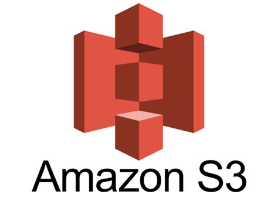

# Simple Storage Service - S3



## Description

S3 was the first service provided by AWS it's used to store files of many types such as photo, music, video & etc.

*Obs: the name of the bucket must be unique (for all buckets in AWS)*

## Capability

S3 has no limit of objects storage in a bucket, considering that more objects more expensive will be the storage bill. 

The limit of object transfer to a Bucket is 5T per object.

## Storage Classes

Storage Classes are the categories which *object* from a Bucket will be storage, this impact in the price, latency and availability of Objects, remember that storage class is applied to objects not from Bucket, so it's possible to have a Bucket with objects in different classes.


**Standard**

This is the default class for S3, it's is more expensive but has more availability and resilience.

**Intelligent**

If a file has not been used for a long time, this class move it to a cheaper class category.

**Standard IA**

Recommended for long time storage duration for example: backups

**OneZone**

Storage in only one zone, less availability but more cheaper.

**Glacier**

Recommended for store files for years, for example: legal files

## Lifecycle

This feature moves bucket objects from a classe to another when detecting some price reducion, and can create exclusion roles if necessary.

## Versioning

S3 provide the possibility of versioning storage objects (can be identified by aws unique id in bucket), this feature helps when users need to come back to different version of the currently object and can helps for object history.

*Example*


## Hosting Website

It's possible to host [static](https://www.pluralsight.com/blog/creative-professional/static-dynamic-websites-theres-difference#:~:text=What%20is%20a%20static%20website,can't%20just%20change%20itself.) website using S3


## Objects Replication

Replicate objects between buckets can be in the same region or cross region (cross AWS Account to, if necessary), this provide a high availabity of the object.

## Permissions

Permission can be manage by IAM / Policies and ACL

**IAM**

Create Policies to give permission to users

*Example:*

```
{
  "Version": "2012-10-17",
  "Statement": [
    {
      "Sid": "AllowGroupToSeeBucketListInTheConsole",
      "Action": ["s3:ListAllMyBuckets"],
      "Effect": "Allow",
      "Resource": ["arn:aws:s3:::*"]
    }
  ]
}
```

**Bucket Policies**

Controll the permission of Bucket, but it's necessary to apply in each bucket one by one

*Example:*

```
{
"Version": "2012-10-17",
"Id": "PutObjPolicy",
"Statement": [{
  "Sid": "DenyObjectsThatAreNotSSEKMS",
  "Principal": "*",
  "Effect": "Deny",
  "Action": "s3:PutObject",
  "Resource": "arn:aws:s3:::DOC-EXAMPLE-BUCKET/*",
  "Condition": {
    "Null": {
      "s3:x-amz-server-side-encryption-aws-kms-key-id": "true"
    }
  }
}]
}
```

**ACL**

Manage the access of Bucket, it's not recommended in high scale use, because is very limited, for example it's not possible to manage access for specific user, only general.

*AWS recommend the use of IAM to control bucket access*

## Data Encryption

Objects in S3 can be encrypted for security reason, AWS recommend de use of [KMS](https://aws.amazon.com/pt/kms/) to encrypt data


